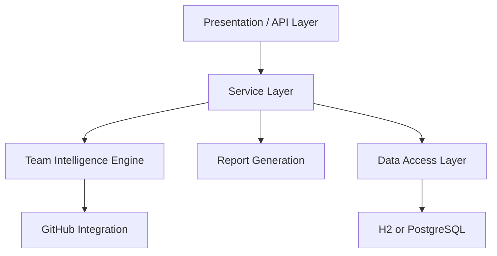

# ProjectSphere

## Unified Student Collaboration & Team Intelligence Platform

### Overview
Student teams often use multiple disconnected platforms for source code, tasks, documentation, communication, and progress tracking. ProjectSphere centralizes these workflows and adds a Team Intelligence Engine for objective contribution analysis and project-health monitoring.

### Key Features
- Team management
- User management
- Project management
- Task management
- Documentation management
- GitHub integration
- Commit tracking
- Pull request tracking
- Contribution scoring
- Free-rider detection
- Project health scoring
- Scheduled analysis
- PDF contribution reports
- Dashboard
- Rule-based recommendations

### Architecture



The layers work as follows:
- Presentation/API Layer: exposes REST endpoints and the static frontend.
- Service Layer: coordinates business logic across users, teams, projects, tasks, documents, GitHub, intelligence, and reports.
- Team Intelligence Engine: calculates contribution scores, detects low-contributors, and evaluates project health using transparent formulas.
- GitHub Integration: fetches commits, pull requests, and activity, with deterministic demo fallback when no token is configured.
- Report Generation: creates PDF reports for individual students and team-level summaries with Apache PDFBox.
- Data Access Layer: persists application state using Spring Data JPA.
- PostgreSQL: production database; H2 is used for development/demo mode.

### Technology Stack
- Java 21
- Spring Boot
- Spring MVC
- Spring Data JPA
- Hibernate
- PostgreSQL
- H2
- GitHub REST API
- Apache PDFBox
- Maven
- HTML/CSS/JavaScript

### Intelligence Engine
ProjectSphere uses three explainable components:

1. Contribution Scorer
2. Free-Rider Detector
3. Project Health Score

#### Contribution Formula
Contribution Score =
Commit Score
+ Code Churn Score
+ Files Score
+ Pull Request Score
+ Task Score

Default weights:
- Commit Score = normalized commits × 30
- Code Churn Score = normalized meaningful churn × 25
- Files Score = normalized files touched × 15
- Pull Request Score = normalized pull requests × 20
- Task Score = task completion rate × 10

Trivial changes reduce effective churn using:
effectiveChurn = totalChurn - trivialChanges

#### Free-Rider Detection
For each member:

z = (memberScore - teamMean) / standardDeviation

Default threshold:
- z <= -1.0

When the threshold is reached, the system labels the member as a "Potential low-contribution member" rather than automatically accusing them.

#### Project Health Formula
Health Score =
(Commit Trend × 0.40)
+ (Task Completion × 0.40)
+ (Deadline Score × 0.20)

Health Classification:
- 80–100 → HEALTHY
- 60–79 → MODERATE
- 40–59 → AT RISK
- 0–39 → CRITICAL

### Prerequisites
- Java 21
- Maven
- PostgreSQL (optional if using H2 demo mode)
- Git
- GitHub account

### Clone
```bash
git clone YOUR_GITHUB_REPOSITORY_URL
cd ProjectSphere
```

### Run (development/demo)
```bash
mvn clean test
mvn spring-boot:run
```

Open: http://localhost:8080. The default `dev` profile uses an in-memory H2
database and loads demo records. Use `mvn -Dspring-boot.run.profiles=prod
spring-boot:run` only after configuring PostgreSQL and all production
environment variables.

### Database Setup
Create PostgreSQL database:

```sql
CREATE DATABASE projectsphere;
```

Configure environment variables:
- DB_URL
- DB_USERNAME
- DB_PASSWORD

Example:
```bash
export DB_URL=jdbc:postgresql://localhost:5432/projectsphere
export DB_USERNAME=postgres
export DB_PASSWORD=postgres
```

If PostgreSQL is not available, the app defaults to H2 demo mode so it can still run locally.

### GitHub API Setup
Set a GitHub token:

```bash
export GITHUB_TOKEN=your_token_here
```

If no token is supplied, the system automatically falls back to demo GitHub data and keeps the intelligence features running.

> Never commit GITHUB_TOKEN or database credentials to GitHub.

### Environment Variables
Use a local `.env` file or export variables in your shell.

Example:
```bash
DB_URL=jdbc:postgresql://localhost:5432/projectsphere
DB_USERNAME=postgres
DB_PASSWORD=postgres
GITHUB_TOKEN=
```

A safe example file is included as `.env.example`.

### GitHub Workflow / CI
The repository includes GitHub Actions workflow in `.github/workflows/build.yml` that runs on push and pull_request.

### Push to GitHub
1. Create a new empty repository on GitHub named ProjectSphere.
2. Do not initialize it with a README if you already have one locally.
3. Add the remote:

```bash
git remote add origin YOUR_GITHUB_REPOSITORY_URL
```

4. Rename the branch:

```bash
git branch -M main
```

5. Push:

```bash
git push -u origin main
```

### Demo Mode
The app ships with demo mode enabled by default:

```properties
app.demo-mode=true
```

This means:
- GitHub failures do not crash the app
- demo activity is used when needed
- the dashboard remains useful during live demos

### API Endpoints
- Authentication: `POST /api/auth/register`, `POST /api/auth/login`
- Dashboard: `GET /api/dashboard`
- Users, teams, projects, tasks, and documents: `/api/users`, `/api/teams`,
  `/api/projects`, `/api/tasks`, and `/api/documents`
- GitHub: `/api/projects/{projectId}/github/*`, `/api/github/demo-status`,
  `POST /api/github/webhook`
- Intelligence: `/api/intelligence/*`
- Reports: `/api/reports/*`

Read-only `GET /api/**` operations are public. All create, update, delete, and
analysis operations require `Authorization: Bearer <JWT>`. See
[`docs/API.md`](docs/API.md) for payloads, response details, and status codes.

### Sample Workflow
1. Open the dashboard.
2. Create a team and add members.
3. Create a project and link a repository.
4. Add tasks and documents.
5. Run the intelligence analysis.
6. Download a PDF contribution report.

### Important Files
- `pom.xml`
- `src/main/java/com/projectsphere/ProjectSphereApplication.java`
- `src/main/resources/application.properties`
- `src/main/java/com/projectsphere/intelligence/ContributionScorer.java`
- `src/main/java/com/projectsphere/intelligence/FreeRiderDetector.java`
- `src/main/java/com/projectsphere/intelligence/ProjectHealthCalculator.java`
- `src/main/java/com/projectsphere/service/IntelligenceService.java`
- `src/main/java/com/projectsphere/github/GitHubClient.java`
- `src/main/java/com/projectsphere/service/ReportService.java`
- `src/main/resources/static/index.html`
- `docs/ARCHITECTURE.md`
- `docs/ALGORITHMS.md`
- `docs/API.md`

### Security Note
Use `/api/auth/register` and `/api/auth/login` to obtain a JWT for write
operations. Set `JWT_SECRET` to a unique base64-encoded secret (at least 32
decoded bytes) when deploying. Never commit JWT, GitHub, webhook, or database
credentials; store them in environment variables or an untracked `.env` file.
Production runs with `SPRING_PROFILES_ACTIVE=prod`, PostgreSQL, Flyway
migrations, and no demo seed data. Configure `GITHUB_WEBHOOK_SECRET` to
authenticate webhook deliveries.

### License
This project is released under the MIT License.
